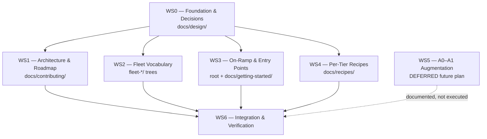

# Tiered Architecture Adoption — Task Plan

Execution plan for adopting the tiered architecture (T0–T5) framing described in
[tiered-architecture-proposal.md](../tiered-architecture-proposal.md). The plan is partitioned into
independent workstreams that multiple agents can execute in parallel on separate git branches.

The proposal is **primarily a documentation and packaging change**. This plan covers the
documentation and reframing work. The single net-new code item the proposal names — the A0–A1 data
augmentation rungs — is intentionally **deferred** and captured as a future workstream
([ws5-augmentation-deferred.md](ws5-augmentation-deferred.md)) so it can be picked up later without
re-deriving scope.

## 🎯 Scope

| In scope                                                           | Out of scope (this round)                             |
|--------------------------------------------------------------------|-------------------------------------------------------|
| Surface T0 as the sanctioned starting path                         | Implementing A0–A1 augmentation code (deferred → WS5) |
| Restructure architecture doc around T0–T5                          | Any Terraform / training / eval code changes          |
| Split "fleet" into fleet delivery (T4) vs. fleet intelligence (T5) | Building unbuilt T5 fleet-intelligence features       |
| Mark T5 components and the T5.0–T5.3 autonomy ladder as roadmap    | Docusaurus theme or build pipeline changes            |
| Add per-tier quick-starts / recipes                                |                                                       |

## 🚦 Execution Gate

> [!IMPORTANT]
> Workstreams WS1–WS4 are **blocked** until WS0 completes. The proposal's Section 7 lists four
> unresolved socialization questions (default tier, fleet vocabulary, roadmap-honesty labeling, Goal
> G scope). Their answers change downstream wording, so WS0 resolves them, records the decisions, and
> publishes a canonical tier-model reference that every other workstream cites. Starting downstream
> work before WS0 lands risks rework and merge conflicts.

## 🧩 Parallelization Strategy

The plan is parallelized by **disjoint file ownership**: each workstream owns a non-overlapping set
of paths, so independent agents never edit the same file. Cross-document references (links, anchors,
shared vocabulary, spell-check dictionary) are centralized in WS0 so downstream workstreams *consume*
them rather than redefine them.

Conflict-avoidance rules every agent follows:

- Edit only files inside your workstream's owned-paths table. Touching another workstream's files is
  prohibited; raise a coordination note instead.
- Treat `docs/design/tier-model.md` (produced by WS0) as read-only canonical truth for tier IDs,
  names, boundaries, and the fleet-delivery vs. fleet-intelligence vocabulary.
- Link to other tiers' content using the path/anchor contract WS0 publishes — do not invent paths
  for files another workstream owns.
- Do not edit shared config (`cspell` dictionary, markdownlint config, Docusaurus `sidebars.js`).
  WS0 pre-seeds new vocabulary; new doc folders self-register via their own `_category_.json`.

## 🗺️ Dependency Graph



## 📋 Workstreams

| ID                                         | Workstream                                  | Owned paths                                                                                              | Phase    | Parallel with     |
|--------------------------------------------|---------------------------------------------|----------------------------------------------------------------------------------------------------------|----------|-------------------|
| [WS0](ws0-foundation-and-decisions.md)     | Foundation & decisions (gate)               | `docs/design/**` (incl. `tier-model.md`), shared `cspell` dictionary                                     | 0        | none (blocks all) |
| [WS1](ws1-architecture-and-roadmap.md)     | Architecture doc + roadmap restructure      | `docs/contributing/architecture.md`, `docs/contributing/ROADMAP.md`                                      | 1        | WS2, WS3, WS4     |
| [WS2](ws2-fleet-vocabulary.md)             | Fleet delivery vs. intelligence split       | `fleet-deployment/**`, `fleet-intelligence/**`, `docs/fleet-deployment/**`, `docs/fleet-intelligence/**` | 1        | WS1, WS3, WS4     |
| [WS3](ws3-onramp-and-entry-points.md)      | On-ramp + entry-point reframing             | `README.md`, `docs/README.md`, `docs/getting-started/**`                                                 | 1        | WS1, WS2, WS4     |
| [WS4](ws4-per-tier-recipes.md)             | Per-tier quick-starts / recipes             | `docs/recipes/**`                                                                                        | 1        | WS1, WS2, WS3     |
| [WS5](ws5-augmentation-deferred.md)        | A0–A1 augmentation (deferred)               | none — future plan only                                                                                  | deferred | n/a               |
| [WS6](ws6-integration-and-verification.md) | Integration, cross-link & lint verification | none exclusive — runs post-merge                                                                         | 2        | none              |

## 🌿 Branch and PR Model

Each workstream is one agent, one branch, one PR. Branch names:

```text
docs/tiered-arch/ws0-foundation
docs/tiered-arch/ws1-architecture
docs/tiered-arch/ws2-fleet-vocabulary
docs/tiered-arch/ws3-onramp
docs/tiered-arch/ws4-recipes
docs/tiered-arch/ws6-integration
```

Merge order: WS0 first. WS1–WS4 open in parallel and merge in any order after WS0. WS6 branches from
`main` after WS1–WS4 have all merged and runs the final cross-document verification.

## ✅ Definition of Done

| Check            | Command                 |
|------------------|-------------------------|
| Markdown lint    | `npm run lint:md`       |
| Spell check      | `npm run spell-check`   |
| Table formatting | `npm run format:tables` |
| Link check       | `npm run lint:links`    |

Each workstream runs all four against its owned files before opening its PR. WS6 runs the full suite
across the entire `docs/` tree after integration.
