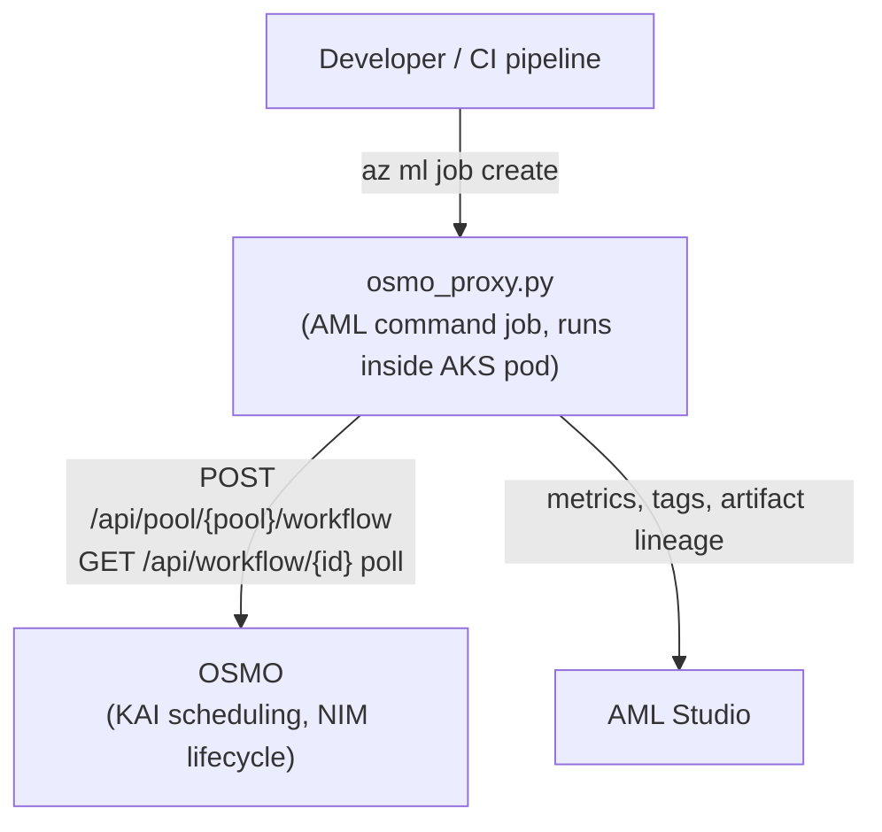

# AML → OSMO Proxy

Run any OSMO workflow from Azure Machine Learning — submit, monitor, and log metrics without modifying the workflow YAML.

## Overview

The proxy bridges standard Azure ML tooling with OSMO cluster orchestration. An AML command job pod submits the workflow to the OSMO REST API, polls until completion, and logs metrics back to AML Studio. Workflow YAMLs are never modified by the proxy.



## Prerequisites

- AML workspace attached to AKS via `infrastructure/setup/02-deploy-azureml-extension.sh`
- OSMO deployed on the same AKS cluster via `infrastructure/setup/03-deploy-osmo.sh`
- `cpu-standard` AML instance type registered (done by step 2 script)
- Azure CLI with `ml` extension installed

## Quick Start

```bash
# Using the submission wrapper (resolves workspace from Terraform outputs)
training/utils/submit-osmo-proxy-job.sh

# Or directly with az ml job create
az ml job create \
  --file workflows/azureml/osmo-proxy-job.yaml \
  --workspace-name <ws> --resource-group <rg> \
  --set environment_variables.WORKFLOW_YAML=workflows/osmo/smoke-test-proxy-e2e.yaml \
  --set environment_variables.AML_SUBSCRIPTION_ID=<subscription-id> \
  --set environment_variables.AML_RESOURCE_GROUP=<rg> \
  --set environment_variables.AML_WORKSPACE_NAME=<ws>
```

## Auth Modes

| Mode | Header | When to use | Configuration |
|------|--------|-------------|---------------|
| `dev` (default) | `x-osmo-user: admin` | Development clusters with `--method dev` OSMO login | Set `OSMO_AUTH_MODE=dev`, `OSMO_USERNAME=admin` (defaults) |
| `token` | `Authorization: Bearer <token>` | Production / shared environments | Set `OSMO_AUTH_MODE=token`, `OSMO_TOKEN` from Key Vault secret `osmo-proxy-token` |

> [!WARNING]
> The OSMO admin token is stored under key `password` (not `token`) in the `osmo-default-admin` Kubernetes secret in the `osmo-control-plane` namespace. Extract it with: `kubectl get secret osmo-default-admin -n osmo-control-plane -o jsonpath='{.data.password}' | base64 -d`

## Workflow Configuration

Set `WORKFLOW_YAML` to the path of the OSMO workflow YAML relative to the repo root. Use `OSMO_SET_VARIABLES` for template substitution without modifying the workflow file:

```bash
--set environment_variables.OSMO_SET_VARIABLES='[{"name":"dataset","value":"vda-demo"}]'
```

> [!NOTE]
> OSMO workflow YAMLs submitted via the proxy use the TemplateSpec REST API. The `platform:` field must be declared on the resource definition, not on the task. Task-level `platform:` is rejected by the API with HTTP 422.

## Metrics Reference

### Tier 1 — Always Logged

Collected on every proxy run from the OSMO API response. No configuration required.

| MLflow key | Type | Description |
|---|---|---|
| `osmo.workflow_id` | tag | OSMO workflow UUID |
| `osmo.status` | tag | Terminal status (`COMPLETED`, `FAILED_*`) |
| `osmo.pool` | tag | OSMO pool name |
| `osmo.first_error` | tag | Error message from first failed task |
| `osmo.task_count` | metric | Total tasks across all groups |
| `osmo.task_completed` | metric | Tasks with status `COMPLETED` |
| `osmo.failed_tasks` | metric | Tasks with any `FAILED*` status |
| `osmo.task_success_rate` | metric | `completed / total` |
| `osmo.duration_seconds` | metric | Workflow wall-clock time |
| `osmo.task_duration_mean_s` | metric | Mean per-task elapsed time |
| `osmo.task_duration_max_s` | metric | Max per-task elapsed time |
| `osmo.task_duration_p95_s` | metric | P95 per-task elapsed time |
| `osmo.group.<name>.task_count` | metric | Per-group task count |
| `osmo.group.<name>.completed` | metric | Per-group completed count |
| `osmo.group.<name>.failed` | metric | Per-group failed count |

### Tier 2 — Spec-Driven Blob Metrics (Optional)

The proxy reads declared output URLs from the OSMO workflow YAML, lists blobs matching each rule's source pattern, fetches matched JSON files using MSI auth, applies transforms, and logs results as `osmo.workflow.<name>` MLflow metrics. No changes to the OSMO workflow YAML are required.

Set `OSMO_METRICS_SPEC` to the path of a spec file at submission time. See `workflows/osmo/osmo-metrics-spec-schema.yaml` for the full schema reference.

```bash
--set environment_variables.OSMO_METRICS_SPEC=path/to/my-metrics-spec.yaml
```

## Environment Variables

| Variable | Required | Default | Description |
|---|---|---|---|
| `WORKFLOW_YAML` | Yes | `workflows/osmo/smoke-test-proxy-e2e.yaml` | Path to OSMO workflow YAML (relative to repo root) |
| `OSMO_GATEWAY_URL` | No | `http://osmo-gateway.osmo-control-plane.svc.cluster.local` | OSMO in-cluster gateway URL |
| `OSMO_POOL` | No | `default` | OSMO pool name |
| `OSMO_AUTH_MODE` | No | `dev` | Auth mode: `dev` or `token` |
| `OSMO_USERNAME` | No | `admin` | Username for dev auth mode |
| `OSMO_TOKEN` | Conditional | — | Bearer token for token auth mode |
| `POLL_INTERVAL_SECS` | No | `30` | Seconds between status polls |
| `OSMO_SET_VARIABLES` | No | — | JSON array `[{"name": "k", "value": "v"}]` for workflow template substitution |
| `OSMO_METRICS_SPEC` | No | — | Path to Tier 2 metrics spec YAML file |
| `AZURE_CLIENT_ID` | No | — | MSI client ID for blob auth (Tier 2 metrics, data asset registration) |
| `AML_SUBSCRIPTION_ID` | No | — | Azure subscription for data asset registration |
| `AML_RESOURCE_GROUP` | No | — | Resource group for data asset registration |
| `AML_WORKSPACE_NAME` | No | — | AML workspace for data asset registration |

> [!WARNING]
> `azureml-mlflow` is a required dependency alongside `mlflow`. Plain `mlflow` silently drops all metrics inside AML job pods because it does not register the `azureml://` tracking store plugin. The proxy installs both via the conda overlay in `workflows/azureml/osmo-proxy-job.yaml`.

The proxy must run as an AML job inside the cluster. The `OSMO_GATEWAY_URL` is only reachable from pods inside the AKS cluster.
