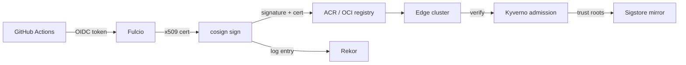

This repository ships a complete reference architecture for signing every container image built
by its CI/CD pipelines and verifying those signatures at admission time on edge clusters. Two
interchangeable signing modes are supported behind a single Terraform variable (`signing_mode`):
the default Sigstore keyless path with cosign, and a Notation + Azure Key Vault (AKV) path for
environments that require enterprise-managed keys. Both modes attach the same four attestation
types and are enforced by the same Kyverno admission posture.

## Signing Modes

| Mode       | Signer                | Key material                  | Transparency log                                | When to choose                                                               |
|------------|-----------------------|-------------------------------|-------------------------------------------------|------------------------------------------------------------------------------|
| `sigstore` | cosign keyless (OIDC) | Ephemeral, Fulcio-issued cert | Public Rekor or self-hosted Sigstore mirror     | Default; lowest operational overhead; strongest identity binding to workflow |
| `notation` | Notation + AKV        | Long-lived RSA key in AKV     | Notary Project signature stored as OCI artifact | Regulated environments requiring HSM-backed, customer-managed keys           |
| `none`     | _disabled_            | _none_                        | _none_                                          | Local development only — admission policies will reject unsigned images      |

Switch modes by setting `signing_mode` in the relevant Terraform deployment. The `should_use_public_rekor` and `should_deploy_sigstore_mirror` toggles control whether Sigstore mode anchors to the public Rekor instance or to the in-cluster mirror provisioned by the [`sigstore-mirror`](../../infrastructure/terraform/modules/sigstore-mirror) module. The `should_enable_premium_acr` toggle gates Notation features that require ACR Premium SKU.

## Sigstore Default Mode

The default path uses GitHub OIDC to obtain a short-lived Fulcio certificate, signs the image digest with cosign, and records the signing event in Rekor.



Build and signing flow:

1. [`container-build-verify.yml`](../../.github/workflows/container-build-verify.yml) builds the image and emits the digest.
2. [`container-publish.yml`](../../.github/workflows/container-publish.yml) signs the digest with cosign keyless and attaches the four attestations described below.
3. [`container-vulnerability-scan.yml`](../../.github/workflows/container-vulnerability-scan.yml) scans the signed digest with Trivy and publishes the CycloneDX result as an additional attestation.
4. The image, signature, and attestations all share the same digest and live alongside each other in the registry.

Identity binding: the cosign certificate's subject is the GitHub Actions workflow ref, so admission policies can require that signatures came from a specific workflow in this repository — not just any workflow with access to ACR.

## Notation Variant Mode

The Notation variant is selected when key custody must remain inside Azure Key Vault. The signing key is provisioned by the [`notation-akv`](../../infrastructure/terraform/modules/notation-akv) Terraform module and never leaves the HSM boundary.

Build and signing flow:

1. [`container-build-verify.yml`](../../.github/workflows/container-build-verify.yml) builds the image and emits the digest.
2. [`container-publish-notation.yml`](../../.github/workflows/container-publish-notation.yml) authenticates to AKV via federated credentials, calls the Notation AKV plugin to sign the digest, and pushes the signature as a sibling OCI artifact.
3. The four attestations are attached using the same predicate types as the Sigstore path, so verification scripts and Kyverno policies need no mode-specific branching beyond signature format.

Key rotation runbook: [`notation-key-rotate.yml`](../../.github/workflows/notation-key-rotate.yml) automates AKV key version promotion, trust-policy update, and Flux-distributed trusted-root refresh. See the workflow's inline runbook for the rotation sequence.

## Attestations

Every signed image carries four attestations in addition to the signature:

| Attestation     | Predicate type                   | Source                                                                        | Consumer                     |
|-----------------|----------------------------------|-------------------------------------------------------------------------------|------------------------------|
| SPDX SBOM       | `https://spdx.dev/Document`      | `syft` during `container-build-verify.yml`                                    | License/dependency review    |
| SLSA provenance | `https://slsa.dev/provenance/v1` | GitHub Actions OIDC + workflow metadata                                       | Build-integrity verification |
| CycloneDX scan  | `https://cyclonedx.org/bom`      | `trivy` during `container-vulnerability-scan.yml`                             | Vulnerability triage         |
| OpenVEX         | `https://openvex.dev/ns/v0.2.0`  | `vexctl` against the curated [`security/vex/`](../../security/vex) statements | Exploitability suppression   |

VEX statements declare which CVEs reported by Trivy are not exploitable in this codebase's actual configuration. The seed file [`security/vex/dataviewer-base.openvex.json`](../../security/vex/dataviewer-base.openvex.json) demonstrates the schema; new statements should be authored alongside the change that introduces or refutes the affected CVE.

## Edge Verification (Offline)

Edge clusters running the [`arc-runners`](../../infrastructure/terraform/modules/arc-runners) module can verify signatures without reaching the public Sigstore infrastructure. The [`sigstore-mirror`](../../infrastructure/terraform/modules/sigstore-mirror) module deploys an in-cluster mirror of the Sigstore trust roots, and Flux distributes the trusted-root bundle via [`trusted-root-refresh-cronjob.yaml`](../../fleet-deployment/gitops/clusters/base/admission/trusted-root-refresh-cronjob.yaml).

Manual verification at the edge or in CI:

```bash
# Sigstore mode
./scripts/security/verify-image.sh \
  myacr.azurecr.io/dataviewer@sha256:<digest>

# Notation mode (uses notation CLI + AKV-anchored trust policy)
SIGNING_MODE=notation ./scripts/security/verify-image.sh \
  myacr.azurecr.io/dataviewer@sha256:<digest>
```

`verify-image.sh` consumes `signing_mode`-equivalent environment variables, validates the signature, and inspects each of the four attestations. Pester tests under `scripts/tests/security/Verify-Image.Tests.ps1` cover the verification matrix.

## Admission Enforcement

Kyverno is deployed as the admission controller via Flux. Two policies are distributed to every cluster overlay (`dev`, `staging`, `production`):

* [`kyverno-sigstore-policy.yaml`](../../fleet-deployment/gitops/clusters/base/admission/kyverno-sigstore-policy.yaml) — requires a cosign signature whose certificate identity matches this repository's allowed workflow refs.
* [`kyverno-notation-policy.yaml`](../../fleet-deployment/gitops/clusters/base/admission/kyverno-notation-policy.yaml) — requires a Notation signature anchored to the AKV-issued trusted root.

Each policy carries two rules that together form a scope guard, not one signature rule plus one attestation rule:

| Rule                        | Action  | Scope                                                                                                     | Purpose                                            |
|-----------------------------|---------|----------------------------------------------------------------------------------------------------------|----------------------------------------------------|
| `require-signed-images-acr` | Enforce | Images matching `${ACR_LOGIN_SERVER}/*` in the `osmo-workflows`, `azureml`, `dataviewer`, and `fleet-*` namespaces | Reject unsigned private-ACR images at admission    |
| `audit-all-other-images`    | Audit   | Every other image; private-ACR references are excluded via `skipImageReferences`                          | Report, but do not block, third-party images       |

Signature verification is the only admission check. Neither rule validates a SLSA provenance attestation — provenance and the other attestations are produced at build time and consumed by the offline verification tooling, not at admission.

Policies are tested with `kyverno test policies/kyverno/` against pre-rendered fixtures.

### Private-registry credentials

Both policies set `imageRegistryCredentials` so Kyverno can authenticate to a private ACR when fetching signatures. Without it, verification fails with `UNAUTHORIZED`: Kyverno's secret informer is scoped to its own namespace and never reads a workload's `imagePullSecrets`.

| Element              | Value                                                                                              |
|----------------------|----------------------------------------------------------------------------------------------------|
| Credential reference | `imageRegistryCredentials.providers: [azure]` on every `verifyImages` rule in both policies            |
| Identity             | The admission and background controllers authenticate through Azure workload identity; no stored credential |
| Role                 | The managed identity behind `${AZURE_ACR_PULL_CLIENT_ID}` must hold AcrPull on the target registry  |
| Wiring               | [`kyverno-helmrelease.yaml`](../../fleet-deployment/gitops/clusters/base/admission/kyverno-helmrelease.yaml) annotates the controller ServiceAccounts and labels their pods for workload identity |

The `azure` provider acquires a registry token in-process for each fetch, so there is no docker-registry secret to provision or rotate. `${AZURE_ACR_PULL_CLIENT_ID}` is substituted by Flux `postBuild.substituteFrom` from the workflow-config ConfigMap shipped per cluster.

> [!NOTE]
> The managed identity, its AcrPull role assignment, and a federated credential bound to the Kyverno admission and background controller ServiceAccounts must exist before the `azure` provider can authenticate. A non-Azure or fully offline cluster can substitute `imageRegistryCredentials.secrets: [<pull-secret>]` referencing a docker-registry secret in the `kyverno` namespace instead.

### Notation trusted-identity pinning

For Notation, the image-signer identity is pinned by the AKV-rooted certificate chain on the attestor (`attestors[].certificates.certChain`). The reference signing key uses a self-signed leaf certificate whose subject equals its issuer, so cert-chain trust is itself the identity pin.

> [!WARNING]
> Do not add a standalone `attestations:` block to pin trusted identity. A block with no nested `attestors` nil-dereferences `buildNotaryVerifier` and panics Kyverno v1.18, yet still passes the mocked `kyverno test` suite. To restrict identity under a shared CA that issues multiple signer certificates, use attestor-level `trustedIdentities` or the Notation trust policy instead.

### Readiness probe

Run the readiness check, supplying the deployed signing mode:

```bash
./scripts/security/check-admission-readiness.sh --mode notation
```

The trusted-root check is mode-aware. Notation embeds its certificate chain in the policy, so notation mode does not require the sigstore-only `sigstore-trusted-root` ConfigMap.

| `--mode`   | Default trusted-root ConfigMap | Missing or stale behavior                            |
|------------|--------------------------------|------------------------------------------------------|
| `sigstore` | `sigstore-trusted-root`        | Fatal                                                |
| `notation` | `notation-akv-cert-chain`      | Warn — the cert chain is inlined in the policy        |

`--trust-root-configmap <name>` overrides the per-mode default.

> [!WARNING]
> `kyverno test` mocks signature verification, so it validates policy structure and match logic but never exercises live verification or catches a webhook panic. A malformed Notation policy passes the mocked suite and still crashes admission at runtime. Validate a rendered policy against a live Kyverno install before rollout, confirming that a signed image admits and an unsigned image is rejected.

## Troubleshooting

| Symptom                                               | Likely cause                                                                | Remediation                                                                                                 |
|-------------------------------------------------------|-----------------------------------------------------------------------------|-------------------------------------------------------------------------------------------------------------|
| `cosign verify` fails with `no matching signatures`   | Image was rebuilt after signing or the wrong digest was used                | Re-resolve the digest from the registry; never verify by tag                                                |
| Kyverno blocks the image with `failed identity check` | Workflow ref drift after a branch rename or fork                            | Update the policy's `subject` regex; redeploy via Flux                                                      |
| Notation `signature not found`                        | Image was published before notation publishing was enabled in that pipeline | Re-run [`container-publish-notation.yml`](../../.github/workflows/container-publish-notation.yml)           |
| Kyverno webhook panics or pods fail admission with an internal error on the notation policy | A malformed `attestations:` block with no nested `attestors` nil-dereferences Kyverno v1.18 | Pin identity through the attestor certificate chain instead, then verify the rendered policy against a live Kyverno install to confirm admission |
| Private-ACR signature fetch fails with `UNAUTHORIZED` | Policy is missing `imageRegistryCredentials`, or the Kyverno controllers' workload identity lacks AcrPull on the registry | Confirm the policy references `providers: [azure]` and that the `${AZURE_ACR_PULL_CLIENT_ID}` identity holds AcrPull with a federated credential bound to the admission and background controller ServiceAccounts |
| Edge cluster cannot reach Rekor                       | Outbound egress is blocked, expected on airgapped fleets                    | Confirm `should_deploy_sigstore_mirror = true` and the mirror pod is healthy                                |
| Trivy reports CVEs already triaged                    | VEX attestation missing or stale                                            | Add or update a statement under [`security/vex/`](../../security/vex) and re-run the vulnerability workflow |

For a project-aware build configuration walkthrough, use the [`/configure-container-build`](../../.github/prompts/configure-container-build.prompt.md) prompt.

## Related Documentation

* [Release Verification](release-verification.md): Verify release artifact provenance and SBOM attestations
* [Threat Model](threat-model.md): STRIDE-based threat analysis covering supply-chain risks
* [Workflow Permissions](workflow-permissions.md): GitHub Actions permission scopes for signing workflows
* [Sigstore Mirror module](../../infrastructure/terraform/modules/sigstore-mirror): In-cluster Sigstore trust-root mirror
* [Notation+AKV module](../../infrastructure/terraform/modules/notation-akv): AKV-backed Notation signing key provisioning
