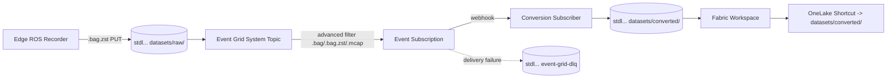

Event Grid system topic + subscription, an in-account dead-letter container, and a Microsoft Fabric capacity + workspace wired against the platform-owned ADLS Gen2 data-lake account (`stdl...`) for the data-conversion pipeline. Raw blobs land under `datasets/raw/` and converted artifacts under `datasets/converted/` — both prefixes are owned by the platform module.

The module is opt-in. The root composition gates it behind `should_deploy_conversion_pipeline = false` so existing deployments remain unaffected until the conversion compute (issues #32, #34, #72) is wired in.

## 📋 Prerequisites

| Requirement                 | Notes                                                                                                                                                                  |
|-----------------------------|------------------------------------------------------------------------------------------------------------------------------------------------------------------------|
| Terraform                   | `>= 1.9.8, < 2.0`                                                                                                                                                      |
| `azurerm` provider          | `>= 4.51.0`                                                                                                                                                            |
| `microsoft/fabric` provider | `1.3.0`                                                                                                                                                                |
| Operator identity           | Member of a security group allow-listed under the Fabric tenant admin setting "Service principals can use Fabric APIs" (or the equivalent user/CLI-context allow-list) |
| Authentication              | `az login` against the target tenant. The Fabric provider falls back to Azure CLI auth when no provider block is declared                                              |
| Platform module outputs     | `data_lake_storage_account` (typed object: `{ id, name }`), `datasets_container` (typed object: `{ id, name }`)                                                        |

> [!IMPORTANT]
> The conversion pipeline reuses the platform `stdl...` data-lake account. The root composition enforces this with a precondition: `should_deploy_conversion_pipeline = true` requires `should_create_data_lake_storage = true`. The check lives on a `terraform_data.conversion_pipeline_precondition` resource at root because Terraform does not support `lifecycle.precondition` inside `module` call blocks.

## 🚀 Usage

The module is composed by the root `infrastructure/terraform/main.tf`. To enable in any environment, set both flags in the corresponding tfvars file under `infrastructure/examples/`:

```hcl
should_deploy_conversion_pipeline = true
should_create_data_lake_storage   = true
conversion_pipeline_config = {
  should_create_fabric_capacity        = true
  should_create_fabric_workspace       = true
  fabric_capacity_sku                  = "F8"
  should_enable_event_grid_dead_letter = true
  fabric_admin_members                 = ["[email protected]"]
}
```

> [!NOTE]
> Use `F2` in dev for cost. Staging and prod should size the Fabric capacity for expected workload concurrency (`F8`+).

## 🏗️ Architecture



## ⚙️ Configuration

| Variable                               | Default                         | Purpose                                                                                                                                                |
|----------------------------------------|---------------------------------|--------------------------------------------------------------------------------------------------------------------------------------------------------|
| `should_enable_event_grid_dead_letter` | `true`                          | Provision an in-account `event-grid-dlq` container on the platform data-lake account                                                                   |
| `raw_blob_suffix_filters`              | `[".bag", ".bag.zst", ".mcap"]` | Suffix list for the Event Grid `string_ends_with` advanced filter                                                                                      |
| `conversion_subscriber_url`            | `null`                          | Webhook URL for the conversion subscriber. Subscription is DLQ-only when `null`                                                                        |
| `should_create_fabric_capacity`        | `true`                          | Provision a new Fabric capacity                                                                                                                        |
| `should_create_fabric_workspace`       | `true`                          | Provision a Fabric workspace. `capacity_id` resolves at apply time via a deferred lookup                                                               |
| `fabric_capacity_sku`                  | `F2`                            | Fabric capacity SKU (`F2` through `F2048`)                                                                                                             |
| `fabric_admin_members`                 | `[]`                            | Entra UPNs/object IDs granted Fabric capacity administration                                                                                           |
| `fabric_workspace_sp_object_id`        | `null`                          | Object ID of the Fabric workspace SP. Grants `Storage Blob Data Reader` on the datasets container plus an ADLS Gen2 ACL granting `rwx` on `converted/` |

## 📥 Inputs

| Input                       | Type                             | Description                                                                                       |
|-----------------------------|----------------------------------|---------------------------------------------------------------------------------------------------|
| `environment`               | `string`                         | `dev`, `staging`, or `prod`                                                                       |
| `resource_prefix`           | `string`                         | Prefix used in resource naming                                                                    |
| `instance`                  | `string`                         | Instance identifier (`001`, `002`, ...)                                                           |
| `location`                  | `string`                         | Optional location override; defaults to `resource_group.location`                                 |
| `resource_group`            | `object({ id, name, location })` | Resource group object                                                                             |
| `data_lake_storage_account` | `object({ id, name })`           | Platform-owned ADLS Gen2 data-lake account (`stdl...`) used as the durable raw -> converted store |
| `datasets_container`        | `object({ id, name })`           | Datasets container on the platform-owned data-lake account. Used to scope Fabric SP folder ACLs   |

## 📤 Outputs

| Output                     | Shape                                                           |
|----------------------------|-----------------------------------------------------------------|
| `event_grid_topic`         | `{ id, name, identity_principal_id }`                           |
| `event_grid_subscription`  | `{ id, name }`                                                  |
| `event_grid_dlq_container` | `{ id, name }` or `null` when DLQ is disabled                   |
| `fabric_workspace`         | `{ id, display_name }` or `null` when workspace creation is off |
| `fabric_capacity`          | `{ id, name, sku }` or `null` when reusing an existing capacity |

## 🔍 Validation

| Check             | Command                                                                                                      |
|-------------------|--------------------------------------------------------------------------------------------------------------|
| Format            | `terraform fmt -check -recursive infrastructure/terraform/modules/conversion-pipeline`                       |
| Lint              | `npm run lint:tf`                                                                                            |
| Validate          | `npm run lint:tf:validate`                                                                                   |
| Module unit tests | `cd infrastructure/terraform/modules/conversion-pipeline && terraform init -backend=false && terraform test` |
| Security scan     | `checkov -d infrastructure/terraform/modules/conversion-pipeline --framework terraform`                      |

## 🔧 Optional Components

| Component         | Toggle                                 | Notes                                                               |
|-------------------|----------------------------------------|---------------------------------------------------------------------|
| Dead-letter queue | `should_enable_event_grid_dead_letter` | Backed by an in-account `event-grid-dlq` container on the data-lake |
| Fabric capacity   | `should_create_fabric_capacity`        | Disable to reuse an existing capacity by display name               |
| Fabric workspace  | `should_create_fabric_workspace`       | `capacity_id` is resolved at apply time via a deferred data lookup  |
